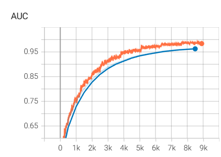
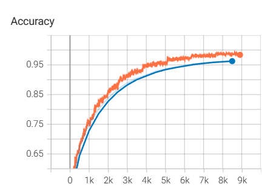
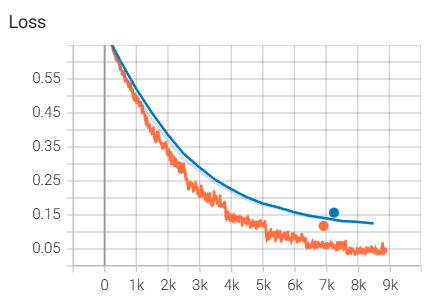

# Deep Interest Network PyTorch Implementation

[Deep Interest Network For Click-Through Rate Prediction](https://arxiv.org/abs/1706.06978)

```shell
python train_local.py \
  --train_data_path "./data/train_data.parquet" \
  --test_data_path "./data/test_data.parquet" \
  --log_dir "./logs" \
  --lau_hidden_sizes 80 40 \
  --mlp_hidden_sizes 200 80
```

 



